<!-- _class: lead -->
# A Decate of wasted cores

## Why building a multi-core scheduler is hard

---

# Table of contents

- Why CPUs are So Fast

- Why Do We Even Need Multi-Core Processing?

- So Let's Fix the Problem

- The Four Scheduling Bugs

- Scheduling in Windows
Why Do We Even Need Multi-Core Processing?

---

# Why CPUs are so fast

- Clock speed
- Cores
- Cache
- Pipelining
- Hyperthreading
- ...

<!--

Modern CPUs (Central Processing Units) are fast due to a combination of architectural advancements, manufacturing improvements, and sophisticated techniques to optimize data flow and processing. However, these advancements also bring about certain challenges. Let's explore the reasons for their speed and the relevant problems including the Von Neumann bottleneck, cache locality, branch prediction, runahead execution, and levels of cache.

### Reasons for Speed

1. **Microarchitecture Improvements**: Over the years, CPU designs have become more efficient, with improvements in pipelining, out-of-order execution, and speculative execution, allowing for more instructions to be processed simultaneously and more efficiently.

2. **Manufacturing Technology**: Advances in semiconductor technology have allowed for smaller transistors. Smaller transistors mean faster switching times and lower power consumption, allowing for more transistors to be packed into the same chip area (Moore's Law). This has led to more complex and powerful CPUs.

3. **Clock Speed**: Increases in the clock speed, the rate at which a processor can complete a processing cycle, have historically contributed to CPU performance. However, due to thermal and power constraints, this is less of a factor now.

4. **Parallelism**: Modern CPUs often have multiple cores, allowing them to perform multiple tasks simultaneously. Additionally, techniques like SIMD (Single Instruction, Multiple Data) enable a single instruction to perform operations on multiple data points simultaneously.

### Relevant Problems

1. **Von Neumann Bottleneck**: This term describes the limitation on throughput caused by the traditional CPU architecture where the same bus is used to fetch both data and instructions. This means that the speed at which data can be fed into the CPU for processing is limited, potentially slowing down execution despite the CPU's capability to process data quickly.

2. **Cache Locality**: Modern CPUs use caches—small, fast memory located close to the CPU cores—to store copies of frequently accessed data and instructions. Cache locality refers to the efficient use of the cache by accessing data in a way that minimizes cache misses. Poor cache locality can lead to frequent cache misses, causing the CPU to waste time fetching data from slower, main memory.

3. **Branch Prediction**: CPUs use branch prediction to guess which way a branch (e.g., an if-else statement) will go so that they can continue executing instructions without waiting for the branch to be resolved. Incorrect predictions can lead to a performance penalty as the CPU needs to discard the incorrectly speculated instructions and fetch the correct ones.

4. **Runahead Execution**: This is a technique to improve CPU utilization during cache misses. Instead of idling, the CPU can execute future instructions that do not depend on the missed data. This can improve performance but requires sophisticated hardware mechanisms to manage and predict dependencies accurately.

5. **Levels of Cache**: Modern CPUs have multiple levels of cache (L1, L2, and sometimes L3 and L4), each with different sizes and speeds. Managing these levels efficiently is crucial for performance. L1 cache is the fastest but smallest, designed for speed, while L2 and L3 caches are larger but slower, designed to hold more data and reduce trips to main memory. Balancing what data is stored in each level of cache to maximize speed and efficiency is a complex problem.

In summary, while modern CPUs are fast due to several architectural and technological advancements, they also face challenges related to the inherent limitations of their design and the complexities of efficiently managing data flow and processing. Addressing these challenges requires ongoing innovation in CPU design and architecture.

-->

---

# Von Neumann Bottleneck

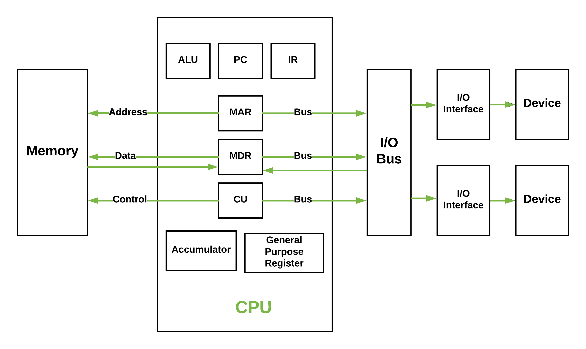

---

# Issues

- The bottleneck occurs because the data transfer rate between the CPU and memory is significantly lower than the rate at which the CPU can process data.
- This discrepancy leads to the CPU often waiting for data to process, reducing overall system efficiency.
- Slows down computing processes.
- Limits the performance of high-speed CPUs.
- Affects the execution of complex programs and multitasking operations.

---

# Harvard Architecture

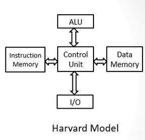

---

# Some advantages

- Simultaneous data and instruction access speeds up CPU operations.
- Eliminates the Von Neumann bottleneck, enhancing overall system performance.
- Separation of data and instruction memory can enhance security, reducing the risk of data corruption and malicious code execution.
- Isolation helps in easier error detection and system stability.

---

# Cache Locality

## Temporal Locality

If a particular memory location is referenced, it is likely that the same location will be referenced again in the near future.

## Spatial Locality

If a particular memory location is referenced, it is likely that nearby memory locations will be referenced in the near future.

---

# NUMA

> Non-Uniform Memory Access

<!--

NUMA is a computer memory design used in multiprocessing, where the memory access time depends on the memory location relative to the processor. Under NUMA, a processor can access its own local memory faster than non-local memory (memory local to another processor or memory shared between processors).

-->

---

# Branch prediction

Branch prediction is a technique used in modern microprocessors to improve the flow of instruction execution.

# Runahead Execution

Runahead execution is a technique used in computer processors to improve performance by executing instructions ahead of time when a cache miss occurs.

---

# NUMA & Cache locality

The problem is these contexts can often belong to a different NUMA node, which can lead to cache misses and increased latency.

Passing context is expensive, and the cost of passing context between cores on different NUMA nodes is even higher.

---

# Real life example

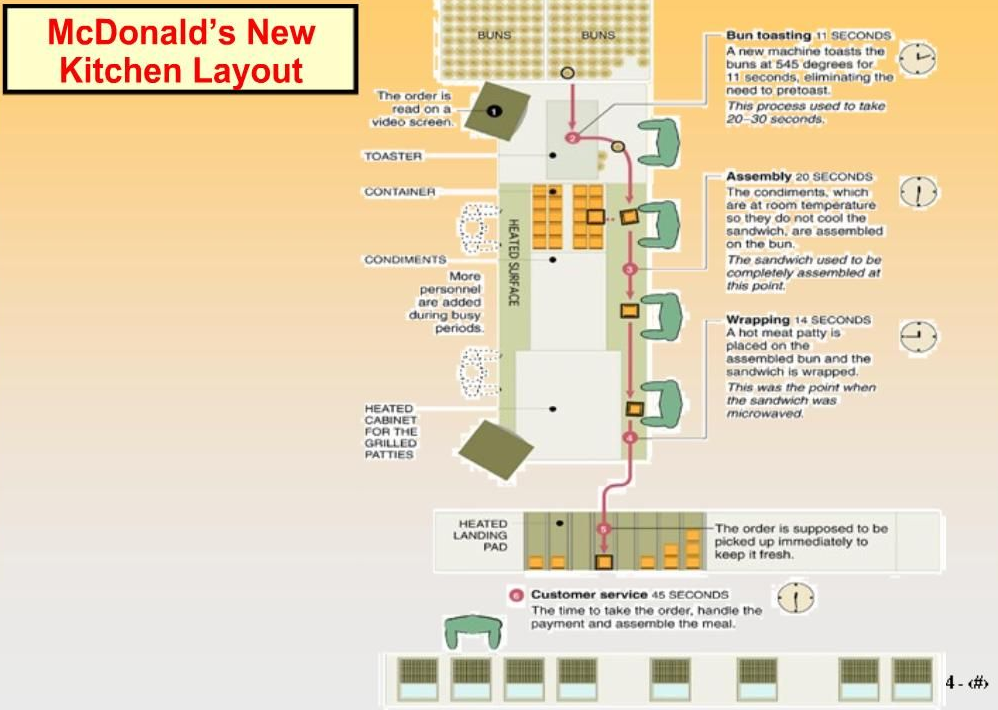

---

# Why do we even need multi-core processing?

> Just avoid the problem?

---

# Limits in clock speed

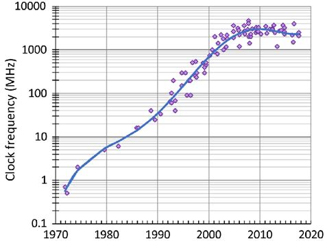

---

# Power consumption

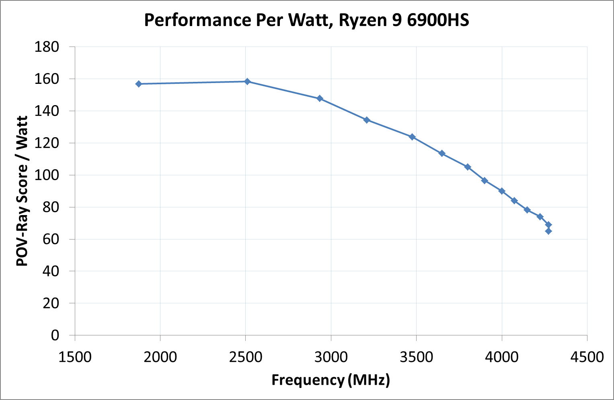

---

# So lets fix the problem

---

# Problem 1. Run queues

A CFS run queue is a list of tasks that are ready to run on a CPU

In a multi-core system, each CPU should have it's own run queue or else it would be slower than a single core system

---

# Problem with simply splitting run queues

A process will forever sit in its run queue

---

# Example

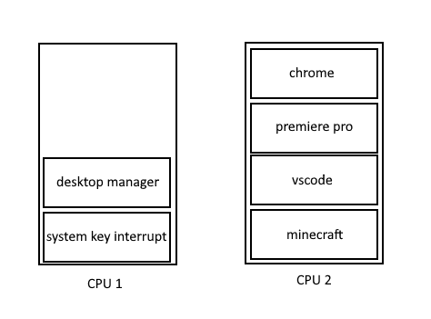

---

# Solution: only load balance periodically

Additionally, issue an "emergency load balance" when a CPU is idle for a long time

# When load balancing

Consider the "distance" between cores

---

# Diagram

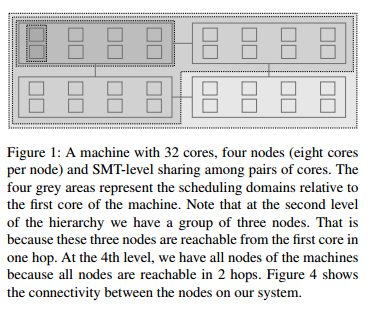

---

# The four scheduling bugs

1. Group imbalance
2. Scheduling group construction
3. Overload on wakeup
4. Missing scheduling domains

---

# Load balancing scenario 1

## Two queues

A. Many high priority threads
B. Many low priority threads

Low and high priority threads get the same cpu time

<!--
one queue has some number of high-priority threads and another queue has the same number of low priority threads. Then high-priority threads would get the same amount of CPU time as low-priority threads. That is not what we want. One idea, then, is to balance the queues based on threads’ weights, not their number.
-->

---

# Load balancing scenario 2

## Two queues

A. One high priority thread
B. Nine low priority threads

High priority thread gets 9x more CPU time, but the high priority thread often sleeps

<!-- Consider a scenario with ten threads in two runqueues: one thread is of high priority and nine threads are of low priority . Let us assume that the weight of the high-priority thread is nine times higher than those of the low-priority threads. With the load balanced according to threads’ weights, one runqueue would contain the high-priority thread, while the other would contain the nine low-priority threads. The high-priority thread would get nine times more CPU than the low-priority threads, which appears to be what we want. However, suppose that the high- priority thread often sleeps for short periods of time, so the first core often goes idle. This core would have to frequently steal work from the other core’s runqueue to keep itself busy. However, we do not want work stealing to become the common case, because this defeats the purpose of per-core runqueues. What we really want is to balance the runqueues in a smarter way, accounting for the fact that the high priority thread does not need a whole core. -->

---

# Group imbalance bug

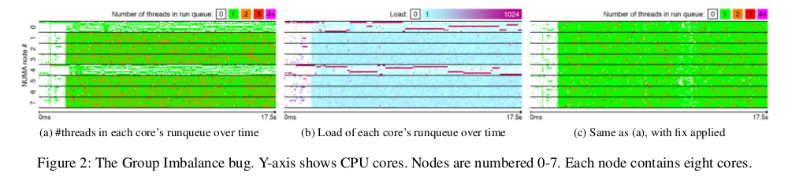

<!-- When a core attempts to steal work from another node, or, in other words, from another scheduling group, it does not examine the load of every core in that group, it only looks at the group’s average load. If the average load of the victim scheduling group is greater than that of its own, it will attempt to steal from that group; otherwise it will not. This is the exact reason why in our situation the underloaded cores fail to steal from the overloaded cores on other nodes. They observe that the average load of the victim node’s scheduling group is not any greater than their own. The core trying to steal work runs on the same node as the high-load R thread; that thread skews up the average load for that node and conceals the fact that some cores are actually idle. At the same time, cores on the victim node, with roughly the same average load, have lots of waiting threads.

The fix was to compare minimum loads instead of the average. The minimum load is the load of the least loaded core in the group. “If the minimum load of one scheduling group is lower than the minimum load of another scheduling group, it means that the first scheduling group has a core that is less loaded than all cores in the other group, and thus a core in the first group must steal from the second group.” With the fix applied the completion time of a make/R workload decreased by 13%, and a 60 thread benchmark with four single-threaded R processes ran 13x faster.
  -->

---

# Scheduling group construction bug

<!-- 

Linux defines a command, called taskset, that enables pinning applications to run on a subset of the avail- able cores. The bug we describe in this section occurs when an application is pinned on nodes that are two hops apart. For example, in Figure 4, which demonstrates the topology of our NUMA machine, Nodes 1 and 2 are two hops apart. The bug will prevent the load balancing algorithm from mi- grating threads between these two nodes. Since threads are created on the same node as their parent thread, the net ef- fect is that the pinned application runs only on one node, no matter how many threads it has. The bug is due to the way scheduling groups are con- structed, which is not adapted to modern NUMA machines such as the one we use in our experiments. In brief, the groups are constructed from the perspective of a specific core (Core 0), whereas they should be constructed from the per- spective of the core responsible for load balancing on each node. We explain with an example.

In our machine, shown in Figure 4, the first scheduling group contains the cores of Node 0, plus the cores of all the nodes that are one hop apart from Node 0, namely Nodes 1, 2, 4 and 6. The second scheduling group contains the cores of the first node not included into the first group (Node 3), plus cores of all nodes that are one hop apart from Node 3: Nodes 1, 2, 4, 5, 7. The first two scheduling groups are thus:

{0, 1, 2, 4, 6}, {1, 2, 3, 4, 5, 7}

Note that Nodes 1 and 2 are included in both scheduling groups. Further note that these two nodes are actually two hops apart from one another. If the scheduling groups were constructed from the perspective of Node 1, Node 1 and 2 would not be together in all groups. Let us see what this implies for load balancing.

Suppose that an application is pinned on Nodes 1 and 2 and that all of its threads are being created on Node 1 (Linux spawns threads on the same core as their parent thread; when an application spawns multiple threads during its initialization phase, they are likely to be created on the same core – so this is what typically happens). Eventually we would like the load to be balanced between Nodes 1 and

    However, when a core on Node 2 looks for work to steal, it will compare the load between the two scheduling groups shown earlier. Since each scheduling group contains both Nodes 1 and 2, the average loads will be the same, so Node 2 will not steal any work!

The bug originates from an attempt to improve the per- formance of Linux on large NUMA systems. Before the in- troduction of the bug, Linux would balance the load inside NUMA nodes and then across all NUMA nodes. New lev- els of hierarchy (nodes 1 hop apart, nodes 2 hops apart, etc.) were introduced to increase the likelihood for threads to re- main close to their original NUMA node.
The fix.

We modified the construction of scheduling groups so that each core uses scheduling groups constructed from its perspective. After the fix, when cores of Node 1 and 2 try to steal tasks at the level of the machine, Nodes 1 and 2 are no longer included in all scheduling groups. The cores are thus able to detect an imbalance and to steal work.

Table 1 presents the perfor- mance difference in NAS applications with and without the Scheduling Group Construction bug. Applications are launched on two nodes with as many threads as there are cores. The maximum slowdown of 27× is experienced by lu. The slowdown is a lot more than the expected 2× be- cause of locking effects. NAS applications use spinlocks and spin-barriers; when all threads execute on the same node due to the taskset bug, the thread that executes the critical section may be descheduled in favour of a thread that will waste its timeslice by spinning. lu is an extreme example of this: it uses a pipeline algorithm to parallelize work; threads wait for the data processed by other threads. When multiple threads are forced to execute on the same core, this results in large performance losses [22]. 
-->

---

# The Overload-on-Wakeup bug

<!-- 
The gist of this bug is that a thread that was asleep may wake up on an overloaded core while other cores in the system are idle. The bug was introduced by an optimization in the wakeup code (select task rq fair function). When a thread goes to sleep on Node X and the thread that wakes it up later is running on that same node, the scheduler only considers the cores of Node X for scheduling the awakened thread. If all cores of Node X are busy, the thread will wake up on an already busy core and miss opportunities to use idle cores on other nodes. This can lead to a significant under-utilization of the machine, especially on workloads where threads frequently wait.

The rationale behind this optimization is to maximize cache reuse. Essentially, the scheduler attempts to place the woken up thread physically close to the waker thread, e.g., so both run on cores sharing a last-level cache, in consideration of producer-consumer workloads where the woken up thread will consume the data produced by the waker thread. This seems like a reasonable idea, but for some workloads waiting in the runqueue for the sake of better cache reuse does not pay off.

This bug was triggered by a widely used commercial database configured with 64 worker threads (1 thread per core) and executing the TPC-H workload. This workload, in combination with transient short-lived threads from other applications, triggers both the Group Imbalance bug 4 and the Overload-on-Wakeup bug. Since we already described the Group Imbalance bug in Section 3.1, we disabled auto- groups in this experiment in order to better illustrate the Overload-on-Wakeup bug.

Figure 3 illustrates several instances of the wakeup bug. During the first time period (noted ❶), one core is idle while a thread that ideally should be scheduled on that core keeps waking up on other cores, which are busy. During the second time period (noted ❷), there is a triple instance of the bug: three cores are idle for a long time, while three extra threads that should be scheduled on those cores keep waking up on other busy cores. 
-->

---

# Missing scheduling domains bug

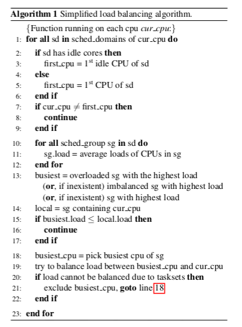

<!--
When a core is disabled and then re-enabled us- ing the /proc interface, load balancing between any NUMA nodes is no longer performed. The bug is due to an incor- rect update of a global variable representing the number of scheduling domains in the machine. When a core is disabled, this variable is set to the number of domains inside a NUMA node. As a consequence, the main scheduling loop (line 1 of Algorithm 1) exits earlier than expected.

As a result, threads can only run on the node on which they ran before the core had been disabled (even if the node they run on is not the same as that on which the core was disabled and then re-enabled). For processes created after disabling the core, all threads will run on the same node as their parent process. Since all processes are usually created from the same “root” process (e.g., sshd daemon and the ssh processes it spawns), this bug usually results in all newly created threads executing on only one node of the machine, regardless of the number of threads.

-->

---

# The discussion that fixes it

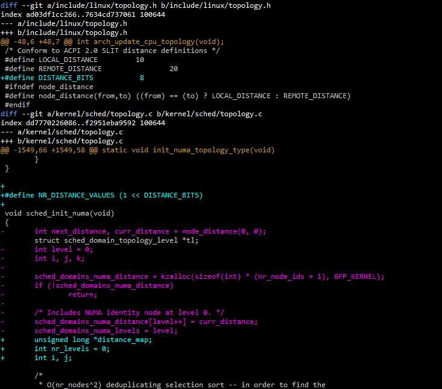

---

# Scheduling in Windows

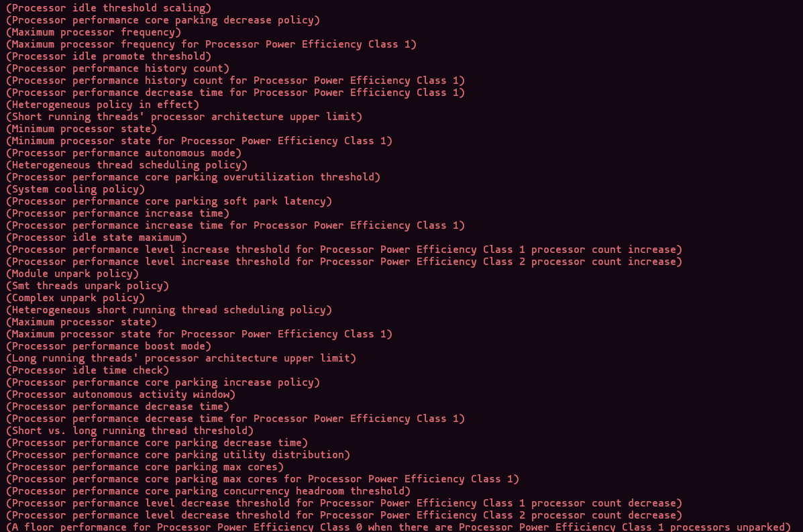

---

Thank you
