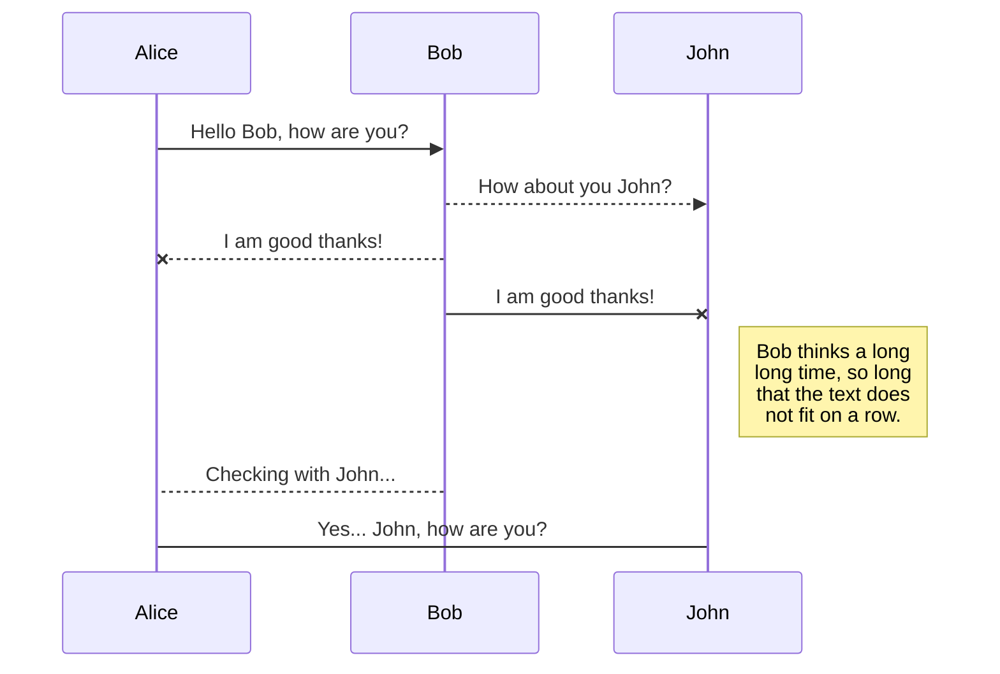
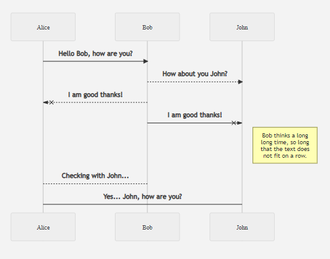

# **Markdown**

Best way to write documents

<footer align="right">
<h1 style="color: white; text-shadow: none;">Created by nopeless</h1>
</footer>

---

# Why Markdown? part 1

* :feather: Increadibly small file size (150KB word document is 4KB in markdown)
* :rocket: Insanely fast opening, saving, and closing speed. No need to wait for documents to load
* :money_with_wings: Completely open source and free. No more Microsoft Word BS
* :computer: Editable offline, always. Google docx more like internet docx

---

# Why Markdown? part 2

* :spider_web: Extensible with plugins and extensions
* 👯‍♀️ Convert and export to pdf, html, docx, and more with ease with pandoc and other tools
* 💯 Fast styles. Changing all font sizes is 4 lines of code. No need to click through menus 🤮 
* :hammer_and_wrench: Easy for others to edit, easy to show on GitHub. Due to its structure, collaboration and version control is a breeze

---

# You can create pdfs fast

```sh
# Create a new file
touch ./my_new_file.md

# Add some content
echo "# Hello World!" >> ./my_new_file.md

# Convert to PDF for your professor
pandoc ./my_new_file.md -o ./my_new_file.pdf
```

---

# Result

> This isn't much but we can improve


---

## Features

* Fast, intuitive *italics*, **bold**, ~~strikethrough~~, and `code`
* > Quotes
* $\LaTeX$ support (most of the time)
* [Links](), images, and gifs
* ```python
  print("And code")
  ```
* And lists, obviously...
* <p align="center"></p>

---

# Tools to use markdown

* For Visual Studio Code users, you already have markdown installed! To export as pdf, you can either download an extension or follow step 2
* For other users, use pandoc to convert to pdf


---

## Syntax

```md
# Title

## Subtitle

*italics*, **bold**, ~~strikethrough~~, and `code`

> Quotes

$\LaTeX$

[Links](https://stem.help)


* List item 1
* List item 2

1. List item 1
2. List item 2
```

---

# Advanced usages

Hold tight, we are going to see some Markdown magic

---

# You can use html tags

```md
<style>
    .green {
        color: green;
    }
</style>

<h1 class="green">Centered text</h1>
```

<style>
    .green {
        color: green;
    }
</style>

<h1 class="green">Centered text</h1>

---

# You can create tables

```md
| Header 1 | Header 2 | Header 3 |
|----------|----------|----------|
| Item 1   | Item 2   | Item 3   |
| Item 4   | Item 5   | Item 6   |
```
| Header 1 | Header 2 | Header 3 |
|----------|----------|----------|
| Item 1   | Item 2   | Item 3   |
| Item 4   | Item 5   | Item 6   |

---

# $\LaTeX$

```latex
$$
\begin{align}
    \frac{d}{dx} \int_{a}^{x} f(t) \, dt &= f(x) \\
    \int_{a}^{b} f(x) \, dx &= F(b) - F(a)
\end{align}
$$
```

$$
\begin{align}
    \frac{d}{dx} \int_{a}^{x} f(t) \, dt &= f(x) \\
    \int_{a}^{b} f(x) \, dx &= F(b) - F(a)
\end{align}
$$

---

# You can syntax highlight code

&#96;&#96;&#96;python
print("Hello World!")
&#96;&#96;&#96;

Turns into

```python
print("Hello World!")
```

---

# Create interactive documents

<details><summary>Toggle me!</summary>Peek a boo!</details>

---

*Note: some of these items aren't supported by certain editors*

#### Foot notes

Hey, check this footnote. [1]

[1]: This is a footnote

---

*Note: some of these items aren't supported by certain editors*

#### Checkmarks

- [x] This is a complete item
- [ ] This is an incomplete item

#### More syntaxes

==highlight==

H~2~O (subscript)
x^2^y (superscript)

---

# Emojis

No need to open up unicode insert menu

these are

`:joy: :+1: :-1:`

:joy: :+1: :-1:

---

#### With plugins, embed diagrams





---

# Thank you

Did you know? This presentation was made with Markdown


Follow me on GitHub! `nopeless@github.com`